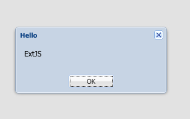

JavaScript ExtJS CDN Demo
=========================

使用CDN上提供的extjs来写程序。找不到这方面的例子，一点点试出来要使用哪些文件（有几千个文件）。

```
open index.html
```



Resources
---------

- ext cdn: <https://cdnjs.com/libraries/extjs>
